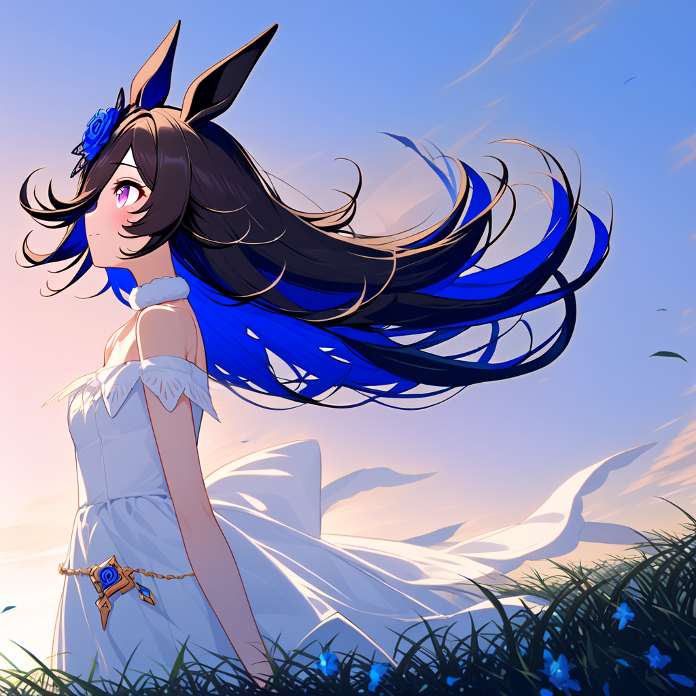
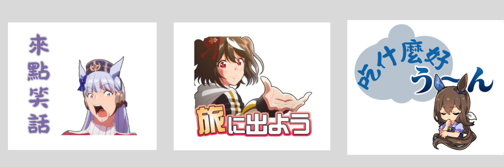
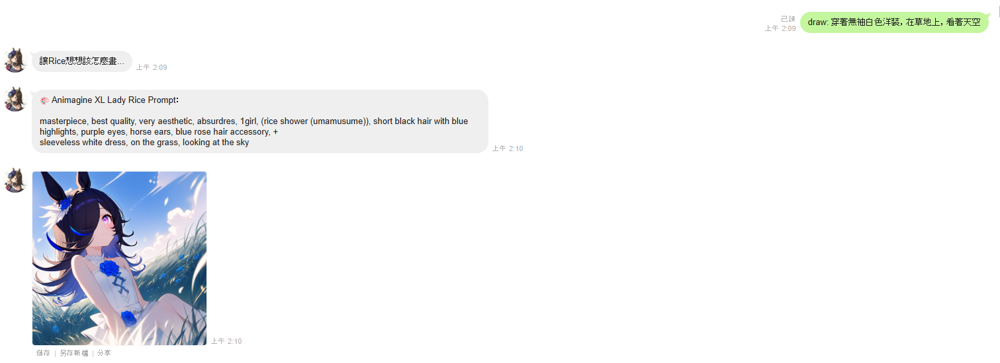
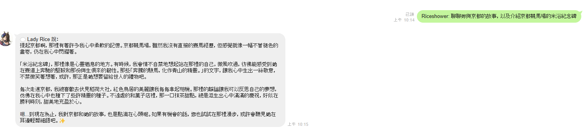
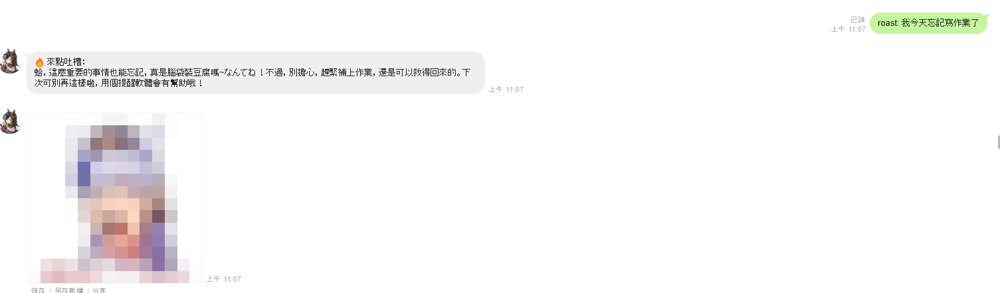
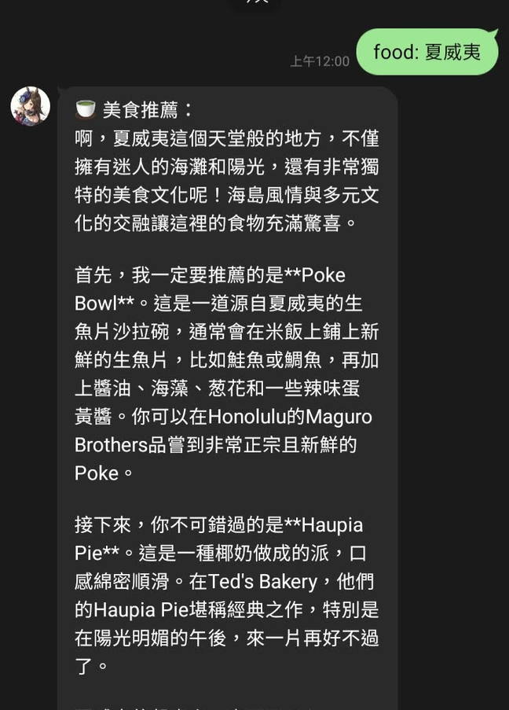
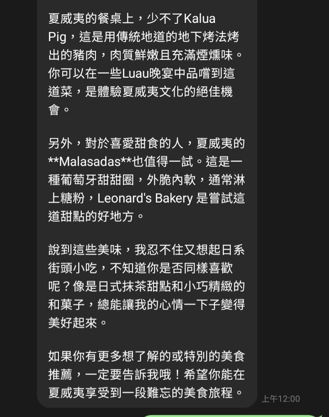
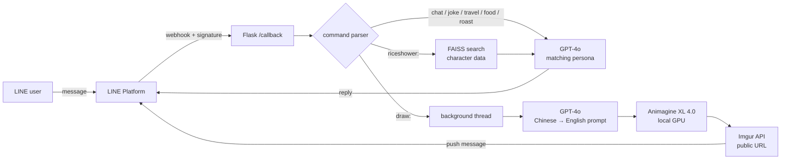

# LadyRice — A Role-Playing LINE Chatbot

**English** | [繁體中文](README.zh-TW.md)

> A LINE chatbot that brings LadyRice, a fan-made virtual character, to life: she chats in character, draws illustrations of herself, and answers questions about her own backstory.
> Built with **GPT-4o role-play**, a **RAG character knowledge base**, and **local Stable Diffusion image generation**.


📑 **Presentation slides (Chinese):** [Lady Rice slides (PDF)](https://drive.google.com/file/d/18i9WwEniv7iFrc9KGTGYSc9pLM2RFVdr/view?usp=sharing)

<p align="center">
  
  <br>
  <sub>Generated live by the <code>draw:</code> command (Animagine XL 4.0)</sub>
</p>

## Overview

LadyRice is a fan-made character based on Rice Shower from *Umamusume: Pretty Derby*. She has short black hair with blue highlights, purple eyes, and a blue rose hair accessory. She is shy and gentle, loves matcha sweets and street fashion, and is written as a virtual influencer who travels between Kyoto and Tokyo.

This project turns her into a LINE Official Account. Users can chat with her directly, or use commands to switch modes: ask her to draw a picture of herself, ask about her past, or have her tell a joke or roast them.

> This was a demo completed in June 2025 and is no longer running.

The bot's persona and replies are in Traditional Chinese.

## Features

| Command | What it does | How |
|---|---|---|
| *(plain chat)* | Talks in LadyRice's voice and remembers the last 10 messages | GPT-4o + system prompt + per-user chat history |
| `draw:<description>` | Generates an illustration of LadyRice from a Chinese description | GPT-4o writes an English prompt → Animagine XL 4.0 on a local GPU → hosted on Imgur |
| `riceshower:<question>` | Answers questions about the character's background, tastes, and history without making things up | RAG: FAISS vector search + few-shot tone examples |
| `roast:<text>` | Snarky roast mode, sent with a random reaction image | Persona switch + weighted random sticker |
| `joke:` / `travel:` / `food:` | Jokes, travel tips, food recommendations | Persona switch |

A **Rich Menu** lets users trigger the joke, travel, and food modes by tapping instead of typing. Commands also accept the full-width colon that Chinese keyboards produce (`food：京都`).

<p align="center">
  
  <br>
  <sub>The Rich Menu (2500 × 843). Character artwork in the menu is from <i>Umamusume: Pretty Derby</i>, © Cygames, Inc. and the original artists.</sub>
</p>

## Screenshots

**`draw:` — Chinese description → English prompt → generated illustration**



**`riceshower:` — RAG answer, written as if LadyRice is fondly remembering her past self**



**`roast:` — Snarky roast that ends with a teasing "〜なんてね" (just kidding), sent with a random reaction image**



<sub>The reaction image is pixelated for copyright reasons.</sub>

**`food:` — Food-recommendation persona, which still ends on the character's favorite Japanese sweets**

<p>
  
  
</p>

## Architecture



## Technical Highlights

**1. Working around LINE's reply-token time limit**
A LINE reply token can only be used once and expires quickly, but diffusion image generation takes tens of seconds or more. `draw:` replies right away with a short "let me think about how to draw this..." message to use up the token, generates the image on a background thread, and then delivers it with a push message.

**2. RAG character knowledge base**
Character notes (personality, food preferences, favorite places, outfits, relationships) are split into 500-character chunks with a 100-character overlap, embedded with `text-embedding-3-small`, and stored in FAISS. The most relevant chunks are passed to GPT-4o with each question. The prompt also tells the model that when the notes don't cover something, it should say in character that she "has no memory of that", which keeps it from inventing answers.

**3. Keeping the character's appearance consistent**
Her fixed visual traits (hair, eye color, horse ears, blue rose accessory) are hard-coded as a prompt prefix. GPT only fills in the scene, pose, and outfit, so every image shows the same character.

**4. Running an SDXL model on limited VRAM**
`float16` weights, `enable_model_cpu_offload()`, and `enable_attention_slicing()` cut memory use enough for Animagine XL to run on a consumer GPU.

**5. Config-driven personas**
Every mode lives in one `FEATURE_PROMPTS` dict that maps a command to its system prompt and reply prefix. Adding a mode means adding one entry, with no change to the parser.

## Project Structure

```
.
├── app.py              # Flask webhook, command parsing, GPT / RAG / image generation / Rich Menu
├── faiss_db/           # Prebuilt character knowledge vector store (used by riceshower:)
├── static/rich_menu_image.png   # Rich Menu image
├── requirements.txt
├── vercel.json         # Vercel deployment config (see Known Limitations)
├── .env.example        # Required environment variables
└── docs/images/        # Screenshots used in this README
```

## Running Locally

**Requirements:** Python 3.12, an NVIDIA GPU (for `draw:`), a LINE Messaging API channel, an OpenAI API key, and an Imgur API client.

```bash
# 1. Install dependencies
python -m venv venv
venv\Scripts\activate          # macOS / Linux: source venv/bin/activate
pip install -r requirements.txt

# 2. Configure environment variables
copy .env.example .env         # macOS / Linux: cp .env.example .env
# then fill in your keys in .env

# 3. Start the server
python app.py
```

Flask listens on `http://127.0.0.1:5000`. LINE needs a public HTTPS URL for the webhook, so for local development, forward the port with [ngrok](https://ngrok.com/) (`ngrok http 5000`) and set the Webhook URL in the [LINE Developers Console](https://developers.line.biz/console/) to `https://<your-ngrok-host>/callback`.

> On first start, the app downloads the Animagine XL 4.0 weights from Hugging Face (several GB) and creates the Rich Menu on LINE.

> **The `roast:` reaction images are not included.** The originals were anime screenshots, so they were left out for copyright reasons. To use `roast:`, create a `roast_stickers/` folder with your own images; the file names and weights are set in `ROAST_STICKERS` in `app.py`.

## Known Limitations and Next Steps

- **Deployment:** I tried deploying to Vercel ([`vercel.json`](vercel.json)), but local image generation needs a GPU and several GB of dependencies, which exceeds serverless size and hardware limits. Switching to a hosted image-generation API would let `torch` and `diffusers` be dropped so the bot can run on an ordinary cloud host.
- **Chat memory:** History is kept in process memory and is lost on restart. Redis or a database would fix this.
- **Long-term personalization:** The planned feature of remembering user preferences isn't implemented yet. The idea is a second RAG store built from facts about the user instead of the character.

## Timeline

Built over 6 days, May 30 – June 4, 2025.

## Copyright Notice

This is a non-commercial personal learning project. *Umamusume: Pretty Derby* and its characters, including Rice Shower, are © Cygames, Inc. LadyRice is a fan-made character based on Rice Shower. The LadyRice illustrations in this repository were generated with the Animagine XL model. The character artwork in the Rich Menu image is from *Umamusume: Pretty Derby*, © Cygames, Inc. and the original artists. The reaction image in the `roast:` screenshot is pixelated, and the original reaction images are not included.

If you are a rights holder and have concerns about any content here, please contact me through a GitHub issue and I will remove it promptly.
