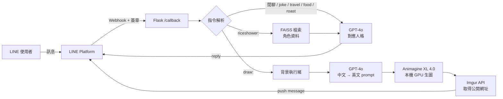

# LadyRice 的生活日常 — 角色扮演 LINE 聊天機器人

[English](README.md) | **繁體中文**

> 把原創虛擬角色「LadyRice」做成一個能在 LINE 上聊天、畫圖、回答自身設定問題的聊天機器人。
> 整合 **GPT-4o 角色扮演**、**RAG 角色知識庫**與**本機 Stable Diffusion 生圖**。


📑 **專案簡報：** [Lady Rice 簡報（PDF）](https://drive.google.com/file/d/18i9WwEniv7iFrc9KGTGYSc9pLM2RFVdr/view?usp=sharing)

<p align="center">
  
  <br>
  <sub>由 <code>draw:</code> 指令即時生成的插圖（Animagine XL 4.0）</sub>
</p>

## 專案簡介

LadyRice 是一位以《賽馬娘》米浴（Rice Shower）為原型的原創角色：深黑色帶藍光短髮、紫色眼睛、藍玫瑰髮飾，個性內向溫柔、熱愛抹茶甜點與街頭穿搭，設定上是遊走於京都與東京之間的虛擬網紅。

這個專案把她變成一個 LINE 官方帳號。使用者可以直接跟她閒聊，也可以透過指令切換成不同模式：請她畫一張自己的插圖、問她關於自己過去的事、叫她講笑話或吐槽。

> 本專案為 2025 年 6 月完成的 demo，目前已停止運作。

## 功能

| 指令 | 功能 | 使用技術 |
|---|---|---|
| （直接聊天） | 以 LadyRice 的人格與口吻對話，並記得最近 10 則對話 | GPT-4o + system prompt + 分使用者對話記憶 |
| `draw:<描述>` | 用中文描述場景，生成一張 LadyRice 的插圖 | GPT-4o 轉英文 prompt → Animagine XL 4.0 本機生圖 → Imgur 託管 |
| `riceshower:<問題>` | 回答關於角色背景、喜好、經歷的問題，不瞎編 | RAG：FAISS 向量檢索 + few-shot 語氣範例 |
| `roast:<內容>` | 毒舌吐槽模式，並附上一張隨機表情包 | 人格切換 + 加權隨機貼圖 |
| `joke:` / `travel:` / `food:` | 講笑話、旅遊建議、美食推薦 | 人格切換 |

另外有**圖文選單（Rich Menu）**，使用者不用記指令，點選即可觸發笑話、旅遊、美食三種模式。指令同時支援全形冒號（`food：京都`）。

<p align="center">
  
  <br>
  <sub>圖文選單（2500 × 843）。選單中的角色圖出自《賽馬娘 Pretty Derby》相關圖片，版權屬於 Cygames, Inc. 及原作者。</sub>
</p>

## 實際畫面

**`draw:` — 中文描述 → 英文 prompt → 生成插圖**


**`riceshower:` — 以 RAG 檢索角色資料，用「懷念過去的自己」的語氣回答**


**`roast:` — 毒舌吐槽，句尾補上「〜なんてね」，並附上一張隨機表情包**


<sub>表情包因版權關係已打上馬賽克。</sub>

**`food:` — 切換成美食推薦人格，最後仍會帶回角色喜愛的日式甜點**

<p>
  
  
</p>

## 系統架構



## 技術重點

**1. 用非同步處理繞過 reply token 的時效限制**
LINE 的 reply token 只能使用一次，且必須在短時間內回覆，但擴散模型生圖需要數十秒以上。`draw:` 會先立刻回覆「讓 Rice 想想該怎麼畫...」用掉 reply token，再開背景執行緒生圖，完成後改用 push message 主動推送結果。

**2. RAG 角色知識庫**
將整理好的角色資料（個性、飲食偏好、喜愛地點、穿搭、人際關係等）以 500 字切塊、重疊 100 字，用 `text-embedding-3-small` 向量化後存入 FAISS。回答時檢索最相關的片段交給 GPT-4o，並在 prompt 中要求資料不足時以角色口吻表示「沒有這方面的記憶」，避免幻覺。

**3. 讓生成的角色外觀保持一致**
角色的固定外觀特徵（髮色、瞳色、馬耳、藍玫瑰髮飾）寫死在 prompt 前綴中，GPT 只負責補上場景、動作、服裝等細節。這樣每次畫出來的都是同一個角色。

**4. 在有限顯示卡記憶體下跑 SDXL 模型**
以 `float16`、`enable_model_cpu_offload()`、`enable_attention_slicing()` 降低 VRAM 用量，讓 Animagine XL 能在消費級顯示卡上執行。

**5. 以設定表驅動的多人格系統**
所有模式集中在 `FEATURE_PROMPTS` 字典，每個指令對應一組 system prompt 與回覆前綴。新增功能只需加一筆設定，不用改解析邏輯。

## 專案結構

```
.
├── app.py              # 主程式：Flask webhook、指令解析、GPT / RAG / 生圖 / Rich Menu
├── faiss_db/           # 預先建好的角色知識向量資料庫（riceshower: 使用）
├── static/rich_menu_image.png   # 圖文選單底圖
├── requirements.txt
├── vercel.json         # Vercel 部署設定（見「已知限制」）
├── .env.example        # 需要設定的環境變數
└── docs/images/        # README 用的截圖
```

## 本機執行

**需求**：Python 3.12、NVIDIA GPU（`draw:` 生圖用）、LINE Messaging API channel、OpenAI API key、Imgur API client。

```bash
# 1. 安裝套件
python -m venv venv
venv\Scripts\activate          # macOS / Linux: source venv/bin/activate
pip install -r requirements.txt

# 2. 設定環境變數
copy .env.example .env         # macOS / Linux: cp .env.example .env
# 接著在 .env 填入各項金鑰

# 3. 啟動
python app.py
```

啟動後 Flask 會在 `http://127.0.0.1:5000` 執行。LINE 需要一個公開的 HTTPS 網址才能送 webhook，本機開發可以用 [ngrok](https://ngrok.com/) 轉發（`ngrok http 5000`），再到 [LINE Developers Console](https://developers.line.biz/console/) 把 Webhook URL 設為 `https://<ngrok 網址>/callback`。

> 首次啟動會從 Hugging Face 下載 Animagine XL 4.0 模型權重（數 GB），並自動向 LINE 建立圖文選單。

> **`roast:` 表情包未包含在 repo 中。**原本使用的表情包是動畫截圖，因版權關係沒有上傳。如需使用 `roast:`，請自行建立 `roast_stickers/` 資料夾並放入圖片，檔名與權重設定在 `app.py` 的 `ROAST_STICKERS`。

## 已知限制與未來方向

- **部署**：曾嘗試部署至 Vercel（[`vercel.json`](vercel.json)），但本機生圖需要 GPU 與數 GB 的相依套件，不符合 serverless 的容量與硬體限制。改用外部生圖 API 後，即可移除 `torch` / `diffusers` 等重量級相依，部署到一般雲端平台。
- **對話記憶**：目前存在記憶體中，重啟後會清空。可改用 Redis 或資料庫保存。
- **長期個人化記憶**：企劃中的「記住使用者偏好」功能尚未實作，規劃以另一個 RAG（以使用者資料為知識庫）實現。

## 開發時程

2025/05/30 – 2025/06/04，共 6 天。

## 版權聲明

本專案為非商業用途的個人學習作品。《賽馬娘 Pretty Derby》及其角色（包含米浴 Rice Shower）的著作權屬於 Cygames, Inc.。LadyRice 是以米浴為原型的二次創作角色。本 repo 中的角色插圖由 Animagine XL 模型生成；圖文選單中的角色圖出自《賽馬娘》相關圖片，版權屬於 Cygames, Inc. 及原作者；`roast:` 截圖中的表情包已打上馬賽克，表情包原檔未上傳。

如果版權方認為本專案有任何不妥之處，請透過 GitHub Issue 與我聯絡，我會立即移除相關內容。
